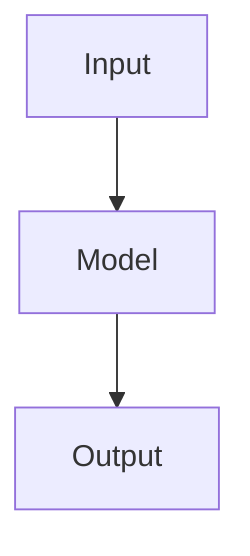
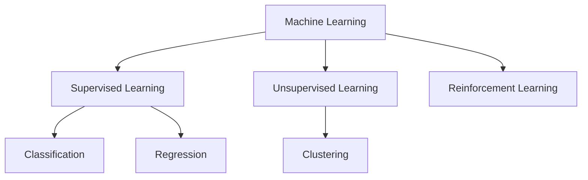

# Content
- [Machine Learning](#machine-learning)
  - [Input Output Mapping](#input-output-mapping)
- [Supervised Learning](#supervised-learning)
  - [Classification](#classification)
  - [Regression](#regression)
- [Unsupervised Learning](#unsupervised-learning)
  - [Clustering](#clustering)
- [Reinforcement Learning](#reinforcement-learning)

# Machine Learning

Machine Learning is similar to function approximation.
It is like making a new function that gets input and gives wanted output.

## Input Output Mapping

Machine Learning is about finding a function that maps input to output.
The function can be linear or non-linear.

## Features

# Supervised Learning
## Classification
- Linear Models
  - [Logistic Regression](LogisticRegression.ipynb)
  - [Support Vector Machines](SupportVectorMachines.ipynb)
- Non-linear Models
  - Nearest Neighbors
    - [k-Nearest Neighbors](KNearestNeighbors.ipynb)
    - [Weighted k-Nearest Neighbors](WeightedKNearestNeighbors.ipynb)
    - [fixed radius neighbors](FixedRadiusNeighbors.ipynb)
  - [Kernal SVM](KernalSVM.ipynb)
  - [Naive Bayes](NaiveBayes.ipynb)
  - [Decision Tree](DecisionTree.ipynb)
  - [Random Forest](RandomForest.ipynb)
## Regression
- [Linear Regression](LinearRegression.ipynb)

# Unsupervised Learning
## Clustering
- Non-Hierarchical Clustering
  - Center-Based: [k-Means](KMeans.ipynb)
  - Density-Based: [DBSCAN](DBSCAN.ipynb)
- Hierarchical Clustering
  - [Agglomerative Clustering](AgglomerativeClustering.ipynb)

# Reinforcement Learning
